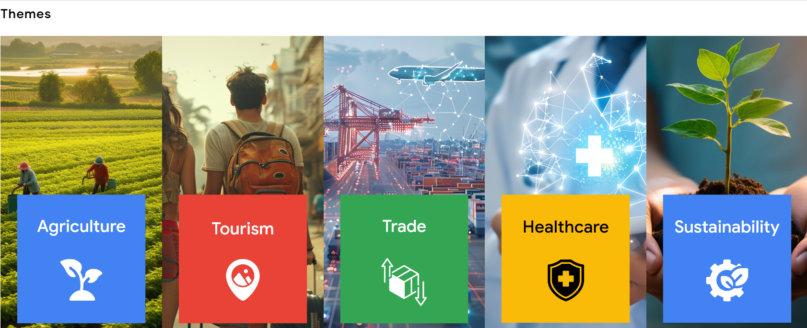
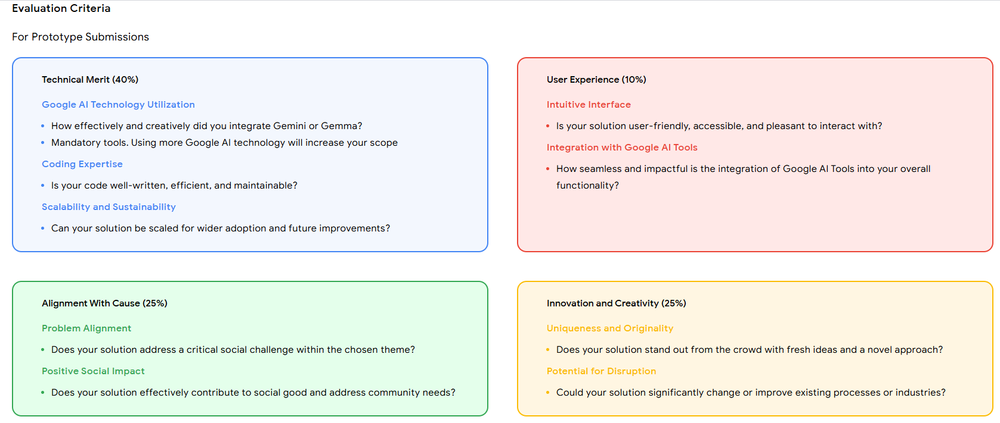

# Google Solution Challenge 2025: Your Complete Guide

Welcome to the definitive resource for the **Google Solution Challenge 2025**, a prestigious global competition empowering university students to tackle real-world challenges using Google technologies. Whether you’re new to coding or a seasoned developer, this A-to-Z guide will equip you with everything you need to participate and excel. Crafted by **Ayesha Javed**, GDGoC ML & AI Co-Lead at COMSATS University Lahore, as of **March 18, 2025**.

---

## Part 1: Understanding the Google Solution Challenge 2025

### What is the Google Solution Challenge?
- **Overview**: The Google Solution Challenge 2025 is an annual competition hosted by Google, inviting university students worldwide to develop innovative, functional projects—such as apps, websites, or hybrid solutions—using at least one Google technology (e.g., Firebase, TensorFlow, Google Cloud). These projects must address a pressing issue aligned with the Themes, including poverty reduction, healthcare improvement, or climate action.
- **Mission**: This challenge aims to enhance your technical skills, foster collaboration (or solo effort), and drive meaningful global or local impact by 2030.
- **Target Audience**: Open to all university students (undergraduate or graduate) affiliated with a Google Developer Group on Campus (GDGoC) or eager to join one. No prior experience is necessary—everyone is welcome!

### What Should You Build?
- **Requirement**: You must create a **functional solution**—a working tech product (e.g., a mobile app, web platform, or hardware-software integration) that tackles an SDG-related problem, not just a theoretical concept.
- **Inspiration**: Think big yet practical! Examples include:
  - A mobile app delivering offline lessons to rural students (SDG 4: Quality Education).
  - A tool tracking carbon footprints in urban Pakistan (SDG 13: Climate Action).
  - An AI-powered health diagnostic tool for remote areas (SDG 3: Good Health and Well-being).

### Leveraging Google Technologies
- **Integration**: Incorporate at least one Google tool to power your project. Examples include:
  - **Firebase**: Manage user data, send notifications, or store project info.
  - **TensorFlow**: Implement AI/ML for predictions or image recognition.
  - **Google Cloud**: Host your app or process large datasets.
  - **Flutter**: Build cross-platform mobile apps.
  - **Google Maps**: Add location-based features.
  - **Gemini API**: Enhance with AI-driven text or chat capabilities.
- **Example**: For an education app, use Firebase to track student progress and TensorFlow to personalize learning recommendations.
- **Flexibility**: Combine with other languages (e.g., Python, JavaScript) as long as Google tech is central.

### Eligible Technologies and AI
- **Mandatory**: Use at least one Google technology from the list above (Firebase, TensorFlow, etc.).
- **AI Options**: Incorporate AI (e.g., TensorFlow for machine learning) if it fits your solution, but it’s optional—simple projects are equally valid.
- **Additional Tools**: Supplement with Wear OS, Angular, DialogFlow, Vertex AI, or other tech, ensuring Google tools are the core.

### Code Ownership Requirements
- **Original Work**: Your team must write the primary code. You cannot submit copied projects, but:
  - Use Google-provided libraries (e.g., TensorFlow models) or open-source code snippets as support.
  - Include a GitHub repo with your code and a README with setup instructions (e.g., “Install Flutter, run `flutter run`”).

### Submission Requirements
- **Components**:
  1. **Demo Video**: A 2-minute video (uploaded to YouTube, public or unlisted) demonstrating your project in action—show functionality, user interaction, and Google tech usage.
  2. **Project Form**: Complete the form at [goo.gle/solutionchallenge](https://bit.ly/3DQZ8uq) with:
     - Team details (names, university, contact info, GDGoC affiliation).
     - Project overview (SDG, Google tech, problem addressed).
     - Links to your YouTube video and GitHub repo.

### Participation Rules
- **Team**: Teams can have upto 1-4 members, so solo participation is allowed.
- **One Entry Per Person**: You can submit as a part of a team—choose one entry per year.

### GDGoC Membership Requirement
- **Mandatory**: At least one team member must be part of a GDGoC by the submission deadline(30 April)
- **How to Join**:Connect with a nearby GDGoC (e.g., COMSATS Lahore, NUST Islamabad).

### Judging Criteria

### Inspirational Past Winning Projects
Explore these top 10 projects from previous years for motivation:
1. **ATTI (2024, South Korea) - 1st Place**
   - **SDG**: 3 (Health)
   - **Solution**: Voice-assistant app aiding dementia patients with memory tasks.
   - **Tech**: Flutter, Google Cloud, Python
   - **Impact**: Supports over 786,000 dementia cases in South Korea.
2. **Spoon Share (2024, India) - 2nd Place**
   - **SDG**: 2 (Zero Hunger)
   - **Solution**: App connecting food donors to those in need, reducing waste.
   - **Tech**: Firebase, Google Maps
   - **Impact**: Tackles hunger and waste in urban India.
3. **Alpha-Eye (2024, Nigeria) - 3rd Place**
   - **SDG**: 3 (Health)
   - **Solution**: AI app for early eye disease detection.
   - **Tech**: TensorFlow, Flutter
   - **Impact**: Prevents vision loss in rural Nigeria.
4. **Saheli (2024, India) - People’s Choice**
   - **SDG**: 5 (Gender Equality)
   - **Solution**: Safety app with SOS and navigation for women.
   - **Tech**: Firebase, Google Cloud, Gemini API
   - **Impact**: Enhances safety in Delhi and beyond.
5. **Wonder Reader (2023, Indonesia) - 1st Place**
   - **SDG**: 4 (Education)
   - **Solution**: 3D-printed braille device for blind students.
   - **Tech**: Google Cloud, Firebase, Flutter
   - **Impact**: Improves education access for visually impaired youth.
6. **Buzzbusters (2023, Bolivia) - 2nd Place**
   - **SDG**: 3 (Health)
   - **Solution**: Early warning system for mosquito-borne diseases.
   - **Tech**: Vertex AI, Google Maps, Firebase
   - **Impact**: Reduces dengue outbreaks.
7. **Blossom (2022, Canada) - 1st Place**
   - **SDG**: 5 (Gender Equality)
   - **Solution**: Menstrual education app for young girls.
   - **Tech**: Android, Firebase, Google Cloud
   - **Impact**: Empowers girls with health insights.
8. **Gateway (2022, Vietnam) - 2nd Place**
   - **SDG**: 3 (Health)
   - **Solution**: Open-source COVID-19 check-in system.
   - **Tech**: Angular, Firebase, TensorFlow
   - **Impact**: Streamlines contact tracing.
9. **FreeSpeak (2020, Indonesia) - Top 10**
   - **SDG**: 4 (Education)
   - **Solution**: ML-powered virtual coach for presentation skills.
   - **Tech**: TensorFlow, Google Cloud
   - **Impact**: Enhances communication skills globally.
10. **Worthy Walk (2020, Pakistan) - Top 10**
    - **SDG**: 3 (Health)
    - **Solution**: App rewarding walking with discounts.
    - **Tech**: Android, Firebase
    - **Impact**: Promotes fitness in Pakistani cities.

### Team Formation Best Practices
- **Diverse Skills**: Include a coder, designer, and presenter if possible to cover all bases.
- **Collaboration Tools**: Use GitHub for code, WhatsApp for communication, and schedule weekly check-ins.

### Common Pitfalls to Avoid
- **Vague Problem Statement**: Avoid broad goals (e.g., “help the world”)—be specific (e.g., “aid Sindh farmers with flood alerts”).
- **Missing Google Tech**: Ensure at least one Google tool is central to your project.
- **Overly Complex Design**: Keep it simple and functional—judge complexity later if time allows.
- **Subpar Video**: Avoid static slides—demo your solution live, and keep it under 2 minutes.

### Google Support and Resources
- **Free Resources**: Enjoy $300 Google Cloud credits, personalized mentorship, and tutorials at [developers.google.com](https://developers.google.com).
- **Access Point**: Register and explore at [goo.gle/solutionchallenge](https://bit.ly/3DQZ8uq)—contact your GDGoC lead for assistance.

### Pakistan-Specific Project Inspirations
- **(Quality Education)**: Develop an offline tutoring app for rural Punjab students.
- **(Clean Water and Sanitation)**: Create a water quality monitoring tool for Karachi’s rivers.
- **(Climate Action)**: Build a flood warning system for Sindh farmers.

### Crafting an Effective Demo Video
- **Structure**: 
  - **Intro (10 sec)**: “We’re Team EcoTech from GDGoC COMSATS Lahore, tackling SDG 13!”
  - **Problem (20 sec)**: “Floods in Sindh disrupt farming—farmers need timely alerts.”
  - **Solution (60 sec)**: “Here’s our app with Firebase alerts and Google Maps zones.”
  - **Impact (20 sec)**: “Tested with 20 farmers, aiming to scale regionally.”
  - **Tech (10 sec)**: “Built with Flutter and Firebase.”
- **Tips**: Use a clear voice, record a live demo (e.g., with OBS Studio), avoid slides, and upload to YouTube (test the link!).

### Benefits of Participation
- **Skill Development**: Master coding, teamwork, and Google tools.
- **Portfolio Growth**: Showcase a standout project on your CV and LinkedIn.
- **Networking Opportunities**: Connect with Google mentors and global peers.
- **Exciting Rewards**: Win swag, cash prizes (up to $3,000 per team member for Top 3), and worldwide recognition.

### Finding Inspiration
- **Past Events**: Watch 2024 Demo Day videos on YouTube for ideas.
- **Community Input**: Discuss with GDSC members or past winners.
- **Local Research**: Explore SDG challenges in Pakistan (e.g., water scarcity, education gaps) to fuel your passion.

### Frequently Asked Questions (FAQs)
- **No GDGoC at My University?**: Join a nearby chapter or start one
- **Can I Pivot My Idea?**: Yes, adjust before submission—experiment early to find the best fit.
- **Do I Need a Deployed App?**: Not required, but a live demo (e.g., on a phone) strengthens your case.

---

## Next Steps
- **Join Now**: Enroll in a GDGoC today
- **Start Planning**: Brainstorm with your team and begin prototyping.
- **Spread the Word**: Share this guide on GitHub, LinkedIn, or WhatsApp to rally your community!

Have questions or need support? Reach out to me at **ayshajavd@gmail.com** or connect on LinkedIn at **[www.linkedin.com/in/ayeshajavedgen](https://www.linkedin.com/in/ayeshajavedgen)**. Together, let’s create a lasting impact with the Google Solution Challenge 2025!
